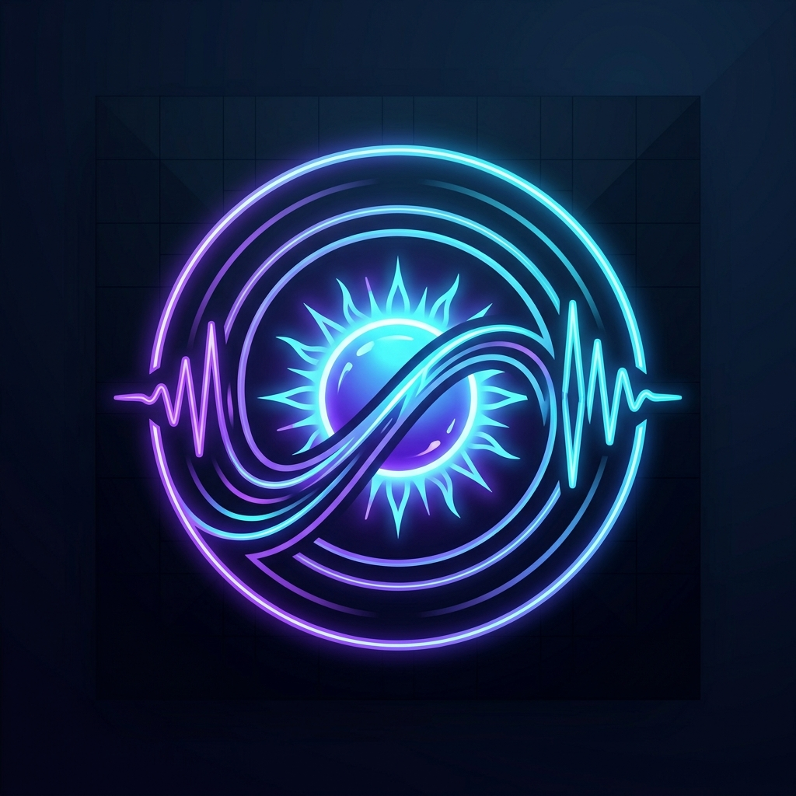

# 🎵 SunoWave Studio — Descargador de Canciones de Suno AI

Una aplicación web de interfaz oscura futurista para escuchar, analizar y descargar canciones generadas en **Suno AI** en múltiples formatos con visualizador de espectro sonoro en tiempo real.



---

## 🚀 Características Principales

- ⚡ **Soporte Universal de Enlaces Suno**: Admite URLs estándar (`https://suno.com/song/[UUID]`), enlaces cortos (`suno.com/s/...`), enlaces de la app móvil o el identificador UUID directo.
- 🎶 **Descarga en MP3 (320 kbps)**: Conversión en tiempo real con Web Audio API y barra de progreso.
- 🎵 **Audio M4A Original**: Flujo de audio de alta fidelidad sin compresión adicional, directo desde los servidores CDN de Suno.
- 🎬 **Video MP4 Oficial**: Descarga del video generado por Suno con animación y carátula oficial.
- 🖼️ **Carátula en Alta Definición**: Imagen de portada en máxima calidad (JPEG/PNG).
- 📜 **Extractor de Letras y Estilo**: Visor de letras completo, botón para copiar y exportación a archivo `.txt`.
- 🌊 **Visualizador de Espectro Neón**: Espectro interactivo en tiempo real renderizado sobre Canvas HTML5 con efecto neón cian y violeta.
- 📑 **Modo por Lotes**: Pega una lista de enlaces para procesarlos secuencialmente.
- 🕒 **Historial Local**: Almacena tus canciones procesadas en `localStorage` para escucharlas o descargarlas cuando quieras sin volver a buscarlas.

---

## 💻 Cómo Ejecutar la Aplicación

Tienes dos formas sumamente sencillas de usar SunoWave:

### Método 1: Lanzador Rápido (Recomendado)
1. Haz doble clic en el archivo `start.bat`.
2. Se iniciará el servidor local ultraligero de PowerShell y se abrirá automáticamente en tu navegador predeterminado en `http://localhost:8080/`.

### Método 2: Abrir Directamente en el Navegador
1. Haz doble clic en el archivo `index.html` (o arrástralo a Google Chrome, Microsoft Edge, Brave o Firefox).
2. ¡Listo! La aplicación cuenta con rotación de proxies CORS públicos y conexión directa a CDN, por lo que funciona sin instalar ningún software ni servidor.

---

## 🛠️ Estructura del Proyecto

```
suno-downloader/
├── index.html            # Interfaz de usuario principal
├── start.bat             # Lanzador de un solo clic para Windows
├── server.ps1            # Servidor HTTP local con proxy CORS (.NET)
├── README.md             # Documentación del proyecto
├── assets/
│   └── logo.jpg          # Logotipo vectorial de la aplicación
├── css/
│   └── style.css         # Sistema de diseño, neón, glassmorphism y responsive
└── js/
    ├── suno-service.js   # Extractor y analizador de canciones de Suno
    ├── audio-converter.js# Descargas Blob, conversión a MP3 320kbps y exportador
    ├── visualizer.js     # Visualizador de audio reactivo en Canvas
    └── app.js            # Controlador de la aplicación, eventos e historial
```

---

## 💡 Cómo Configurar como Espacio de Trabajo en el IDE

Para abrir y trabajar en este proyecto en tu entorno de desarrollo:
1. En el menú superior de Antigravity IDE, selecciona **File > Open Folder...** (Abrir Carpeta...).
2. Selecciona la ruta:
   `C:\Users\Usuario\.gemini\antigravity-ide\scratch\suno-downloader`
3. ¡Tendrás acceso directo a todos los archivos y componentes!
